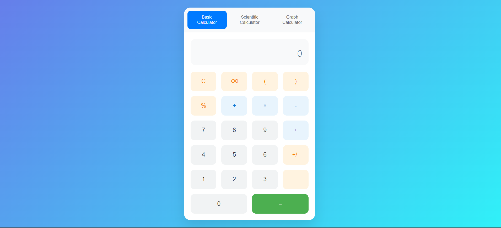
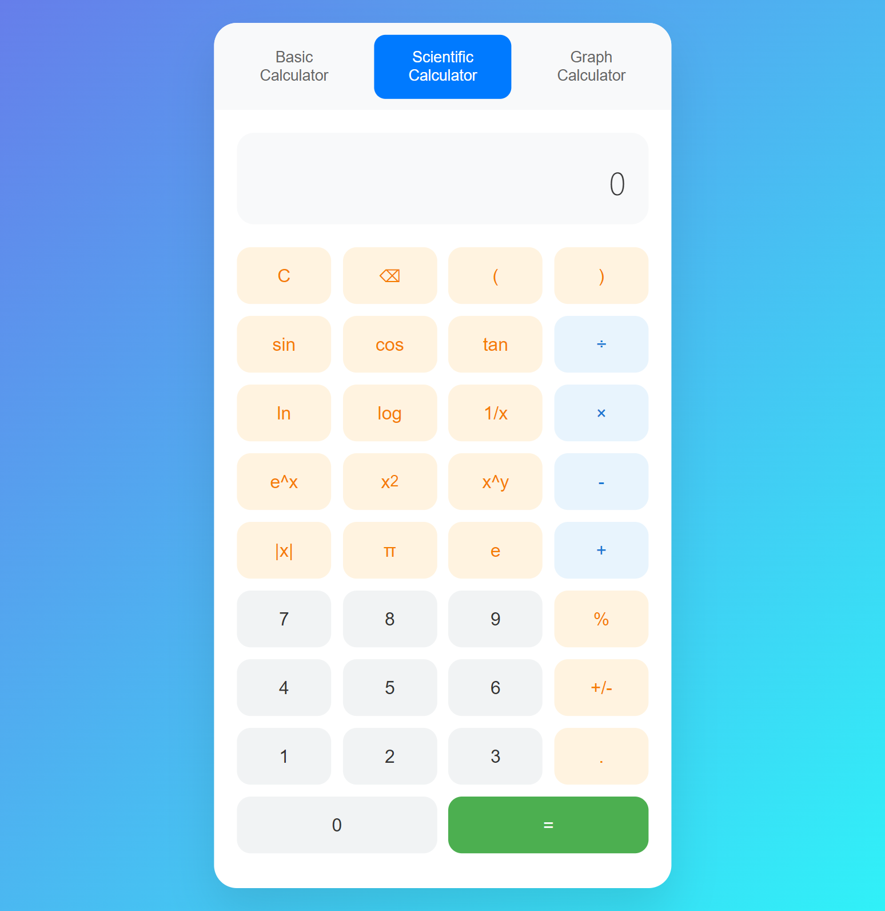
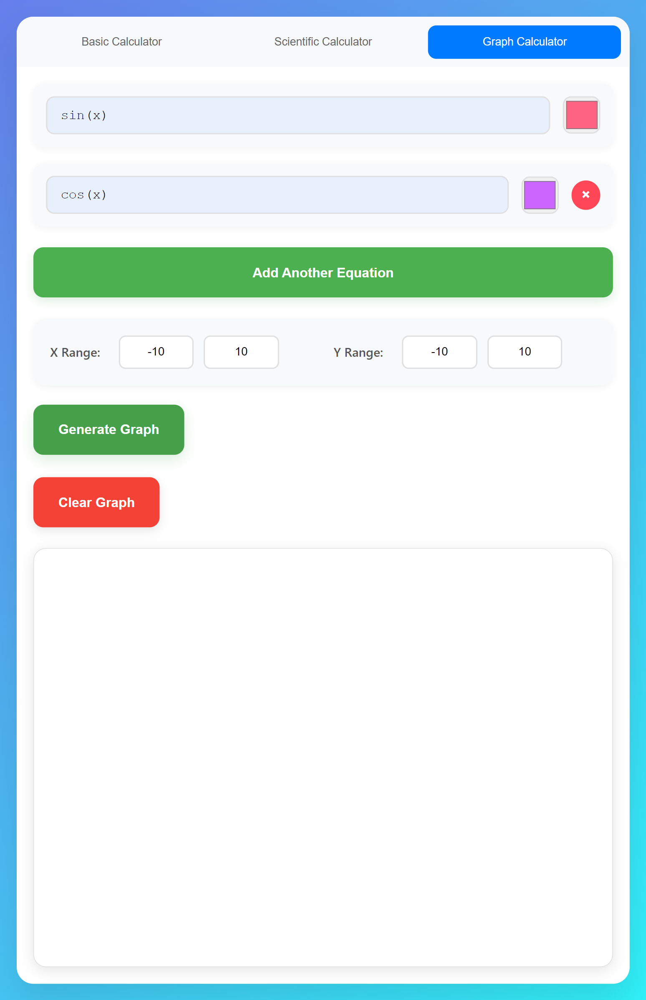

# Calculator Project

A **feature-rich calculator** project with **Basic**, **Scientific**, and **Graphing** functionalities. Built as a web-based application using **HTML, CSS, and JavaScript**, and enhanced with **Chart.js** for graph plotting.

---

## Table of Contents
- [Features](#features)
- [Screenshots](#screenshots)
- [Installation](#installation)
- [Usage](#usage)
- [Folder Structure](#folder-structure)
- [Technologies](#technologies)
- [Contributing](#contributing)
- [License](#license)

---

## Features

### Basic Calculator
- Addition, subtraction, multiplication, division
- Percentage calculation
- Clear and reset functionality

### Scientific Calculator
- Trigonometric functions: sin, cos, tan
- Logarithmic functions: log, ln
- Power and square root calculations
- Parentheses support for complex expressions

### Graphing Calculator
- Plot mathematical functions
- Zoom and pan on the graph
- Real-time updates using **Chart.js**

---

## Screenshots

### Basic Calculator


### Scientific Calculator


### Graphing Calculator


> *Note: Add actual screenshots in a `screenshots` folder.*

---

## Installation

1. Clone the repository:
```bash
git clone https://github.com/Falguni35/calculator.git
